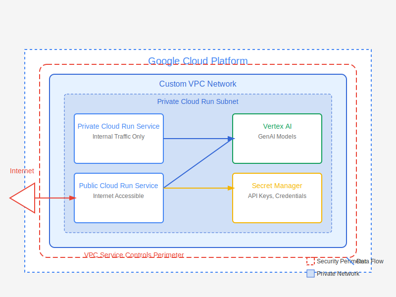

# Secure GCP Cloud Run with Vertex AI Integration

This repository contains Terraform code to deploy a secure Cloud Run environment in Google Cloud Platform (GCP) with Vertex AI integration for GenAI capabilities. The infrastructure is provisioned within a private VPC with appropriate security controls.

## Architecture Overview



The architecture includes:

- Custom VPC network with private subnets
- Serverless Cloud Run services (both private and public)
- Vertex AI integration for GenAI model access
- VPC Service Controls for enhanced security
- Secret Manager for credential management
- IAM permissions with least privilege principle
- Secure CI/CD configuration

## Repository Structure

```
.
├── README.md                 # This file
├── LICENSE                   # MIT License
├── .gitignore                # Git ignore file
├── docs/                     # Documentation
│   ├── architecture-diagram.svg  # Architecture visualization
│   ├── CREDENTIALS-MANAGEMENT.md # Guide for managing credentials
│   ├── IAM-PERMISSIONS.md    # Detailed IAM permissions guide
│   └── PERMISSIONS-README.md # Overview of required permissions
├── environments/             # Environment-specific configurations
│   ├── dev/                  # Development environment
│   │   └── terraform.tfvars  # Development variables
│   └── prod/                 # Production environment
│       └── terraform.tfvars  # Production variables
├── scripts/                  # Utility scripts
│   ├── create-service-account.sh  # Create service account (Linux/Mac)
│   ├── create-service-account.bat # Create service account (Windows)
│   ├── enable-apis.sh        # Enable required APIs (Linux/Mac)
│   └── enable-apis.bat       # Enable required APIs (Windows)
├── .github/                  # GitHub configuration
│   └── workflows/
│       └── terraform.yml     # CI/CD workflow
├── modules/                  # Reusable Terraform modules
│   ├── cloud_run/           # Cloud Run service module
│   │   ├── main.tf
│   │   ├── variables.tf
│   │   └── outputs.tf
│   ├── networking/          # VPC and networking module
│   │   ├── main.tf
│   │   ├── variables.tf
│   │   └── outputs.tf
│   ├── security/            # IAM and security module
│   │   ├── main.tf
│   │   ├── variables.tf
│   │   └── outputs.tf
│   └── vertex_ai/           # Vertex AI module
│       ├── main.tf
│       ├── variables.tf
│       └── outputs.tf
└── terraform/                # Root Terraform configuration
    ├── backend.tf           # Backend configuration for state management
    ├── iam.tf               # IAM configuration with least privilege
    ├── main.tf              # Main Terraform configuration
    ├── outputs.tf           # Output definitions
    ├── provider.tf          # Provider configuration
    ├── variables.tf         # Variable definitions
    └── versions.tf          # Terraform version constraints
```

## Prerequisites

1. Google Cloud Platform (GCP) account with appropriate permissions
2. Terraform v1.5.0 or newer
3. Google Cloud SDK installed and configured
4. Existing GCS bucket for Terraform state (referenced in `backend.tf`)
5. GitHub repository access

## Getting Started

### 1. Clone this repository

```bash
git clone https://github.com/your-org/gcp-cloud-run-vertex-ai.git
cd gcp-cloud-run-vertex-ai
```

### 2. Enable Required APIs

Before deploying the infrastructure, make sure all required APIs are enabled in your GCP project:

```bash
# For Linux/Mac
chmod +x scripts/enable-apis.sh
./scripts/enable-apis.sh your-gcp-project-id

# For Windows
scripts\enable-apis.bat your-gcp-project-id
```

### 3. Create a Service Account for Terraform

Create a service account with the necessary permissions for deploying infrastructure:

```bash
# For Linux/Mac
chmod +x scripts/create-service-account.sh
./scripts/create-service-account.sh your-gcp-project-id terraform-deployer

# For Windows
scripts\create-service-account.bat your-gcp-project-id terraform-deployer
```

This script will:
- Create a service account named "terraform-deployer"
- Grant the necessary IAM roles following the least privilege principle
- Generate and download a service account key file

### 4. Set up environment variables

```bash
# For Linux/Mac
export PROJECT_ID="your-gcp-project-id"
export TF_VAR_project_id="$PROJECT_ID"
export TF_VAR_region="us-central1"
export GOOGLE_APPLICATION_CREDENTIALS="$(pwd)/terraform-deployer-key.json"

# For Windows Command Prompt
set PROJECT_ID=your-gcp-project-id
set TF_VAR_project_id=%PROJECT_ID%
set TF_VAR_region=us-central1
set GOOGLE_APPLICATION_CREDENTIALS=%CD%\terraform-deployer-key.json

# For Windows PowerShell
$env:PROJECT_ID="your-gcp-project-id"
$env:TF_VAR_project_id=$env:PROJECT_ID
$env:TF_VAR_region="us-central1"
$env:GOOGLE_APPLICATION_CREDENTIALS="$(Get-Location)\terraform-deployer-key.json"
```

> **IMPORTANT**: The service account key file contains sensitive credentials. Be sure to:
> - Never commit it to source control
> - Store it securely
> - Rotate it regularly
> - Consider using a secret management solution in production

### 5. Initialize Terraform

```bash
cd terraform
terraform init -backend-config="bucket=your-existing-terraform-state-bucket"
```

### 4. Select environment

Copy the appropriate environment variables:

```bash
# For development
cp ../environments/dev/terraform.tfvars .

# For production
# cp ../environments/prod/terraform.tfvars .
```

### 5. Deploy the infrastructure

```bash
# Verify the plan
terraform plan

# Apply the changes
terraform apply
```

## Component Descriptions

### VPC Network (networking module)

The networking module creates a custom VPC network with private subnets, firewall rules, and VPC Service Controls. It establishes the foundation for secure communications between services.

### Cloud Run Services (cloud_run module)

The Cloud Run module deploys container-based applications in a serverless environment. It configures both private and public-facing services with appropriate IAM permissions and networking settings.

### Vertex AI Integration (vertex_ai module)

This module sets up access to Vertex AI services, particularly GenAI models. It configures the necessary service accounts and IAM permissions for secure AI model access.

### Security Controls (security module)

The security module implements:
- IAM roles and service accounts with least privilege
- Secret Manager for API keys and credentials
- VPC Service Controls for data exfiltration prevention

## Operational Tasks

### Deploying a New Cloud Run Service

1. Update the service definition in the appropriate environment directory
2. Run `terraform plan` and `terraform apply` to deploy the changes

### Accessing Vertex AI Models from Cloud Run

Cloud Run services can access Vertex AI models using the service account created by Terraform. The service account has the minimum required permissions to access specific Vertex AI resources.

### Managing Secrets

Sensitive data like API keys should be stored in Secret Manager. The Cloud Run services are configured with access to the necessary secrets.

### Monitoring and Logging

All services are configured with appropriate logging and monitoring. You can view logs in the GCP Console or export them to your preferred monitoring solution.

## Security Considerations

- **VPC Service Controls**: Prevents data exfiltration by creating a security perimeter around your GCP resources
- **Private Cloud Run Services**: Only accessible within the VPC or via IAP
- **IAM Least Privilege**: Service accounts have minimal permissions needed
- **Network Security**: Firewall rules restrict traffic flow based on need
- **Secret Management**: All sensitive data stored in Secret Manager

### Credential Security Best Practices

When working with GCP service account credentials:

1. **Use separate service accounts** for different purposes:
   - Deployment service account (with administrative permissions)
   - Runtime service accounts (with minimal permissions)

2. **Secure service account keys**:
   - Never commit credentials to source control
   - Use `.gitignore` to prevent accidental commits
   - Rotate keys regularly (every 90 days at minimum)
   - Delete unused keys

3. **Alternatives to service account keys**:
   - For CI/CD: Use Workload Identity Federation
   - For local development: Use gcloud authentication (`gcloud auth application-default login`)
   - For production: Use attached service accounts without downloadable keys

4. **Environment-specific permissions**:
   - Limit production access to only necessary personnel
   - Use more restrictive permissions in production than in development

5. **Audit and monitor**:
   - Enable audit logging for credential usage
   - Set up alerts for suspicious activities
   - Regularly review access patterns

## CI/CD Integration

This repository can be integrated with CI/CD pipelines (GitHub Actions, Cloud Build, etc.) to automate infrastructure deployments. Sample workflow files are included in the `.github/workflows/` directory.

## Common Issues and Troubleshooting

- **Terraform State Lock**: If a Terraform operation fails, the state might be locked. Use `terraform force-unlock [LOCK_ID]` if necessary.
- **Permission Issues**: Ensure your service account has the necessary permissions to create all resources.
- **VPC Service Controls**: If you encounter issues accessing services, check if VPC Service Controls are blocking access.


